

# Module `0x1::optional_aggregator`

This module provides an interface to aggregate integers either via
aggregator (parallelizable) or via normal integers.

-  [Struct `Integer`](#0x1_optional_aggregator_Integer)
-  [Struct `OptionalAggregator`](#0x1_optional_aggregator_OptionalAggregator)
-  [Constants](#@Constants_0)
-  [Function `new_integer`](#0x1_optional_aggregator_new_integer)
-  [Function `add_integer`](#0x1_optional_aggregator_add_integer)
-  [Function `sub_integer`](#0x1_optional_aggregator_sub_integer)
-  [Function `limit`](#0x1_optional_aggregator_limit)
-  [Function `read_integer`](#0x1_optional_aggregator_read_integer)
-  [Function `destroy_integer`](#0x1_optional_aggregator_destroy_integer)
-  [Function `new`](#0x1_optional_aggregator_new)
-  [Function `switch`](#0x1_optional_aggregator_switch)
-  [Function `switch_and_zero_out`](#0x1_optional_aggregator_switch_and_zero_out)
-  [Function `switch_to_integer_and_zero_out`](#0x1_optional_aggregator_switch_to_integer_and_zero_out)
-  [Function `switch_to_aggregator_and_zero_out`](#0x1_optional_aggregator_switch_to_aggregator_and_zero_out)
-  [Function `destroy`](#0x1_optional_aggregator_destroy)
-  [Function `destroy_optional_aggregator`](#0x1_optional_aggregator_destroy_optional_aggregator)
-  [Function `destroy_optional_integer`](#0x1_optional_aggregator_destroy_optional_integer)
-  [Function `add`](#0x1_optional_aggregator_add)
-  [Function `sub`](#0x1_optional_aggregator_sub)
-  [Function `read`](#0x1_optional_aggregator_read)
-  [Function `is_parallelizable`](#0x1_optional_aggregator_is_parallelizable)
-  [Specification](#@Specification_1)

<pre><code><b>use</b> <a href="aggregator.md#0x1_aggregator">0x1::aggregator</a>;
<b>use</b> <a href="aggregator_factory.md#0x1_aggregator_factory">0x1::aggregator_factory</a>;
<b>use</b> <a href="../../aptos-stdlib/../move-stdlib/doc/error.md#0x1_error">0x1::error</a>;
<b>use</b> <a href="../../aptos-stdlib/../move-stdlib/doc/option.md#0x1_option">0x1::option</a>;
</code></pre>

Show all the modules that "optional_aggregator" depends on directly or indirectly

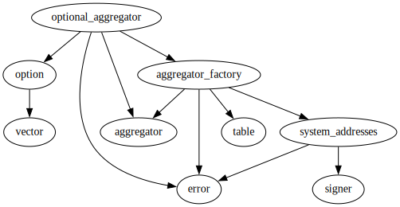

Show all the modules that depend on "optional_aggregator" directly or indirectly

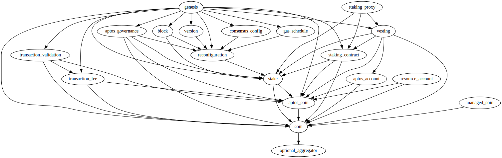

## Struct `Integer`

Wrapper around integer to have a custom overflow limit. Note that
Move has no traits (and trait bounds), so integer value must be u128.
<code><a href="optional_aggregator.md#0x1_optional_aggregator_Integer">Integer</a></code> provides API to add/subtract and read, just like <code>Aggregator</code>.

<pre><code><b>struct</b> <a href="optional_aggregator.md#0x1_optional_aggregator_Integer">Integer</a> <b>has</b> store
</code></pre>

Fields

<dl>
<dt>
<code>value: u128</code>
</dt>
<dd>

</dd>
<dt>
<code>limit: u128</code>
</dt>
<dd>

</dd>
</dl>

## Struct `OptionalAggregator`

Struct that contains either an aggregator or a normal integer, both
overflowing on limit.

<pre><code><b>struct</b> <a href="optional_aggregator.md#0x1_optional_aggregator_OptionalAggregator">OptionalAggregator</a> <b>has</b> store
</code></pre>

Fields

<dl>
<dt>
<code><a href="aggregator.md#0x1_aggregator">aggregator</a>: <a href="../../aptos-stdlib/../move-stdlib/doc/option.md#0x1_option_Option">option::Option</a>&lt;<a href="aggregator.md#0x1_aggregator_Aggregator">aggregator::Aggregator</a>&gt;</code>
</dt>
<dd>

</dd>
<dt>
<code>integer: <a href="../../aptos-stdlib/../move-stdlib/doc/option.md#0x1_option_Option">option::Option</a>&lt;<a href="optional_aggregator.md#0x1_optional_aggregator_Integer">optional_aggregator::Integer</a>&gt;</code>
</dt>
<dd>

</dd>
</dl>

## Constants

<pre><code><b>const</b> <a href="optional_aggregator.md#0x1_optional_aggregator_EAGGREGATOR_OVERFLOW">EAGGREGATOR_OVERFLOW</a>: u64 = 1;
</code></pre>

<pre><code><b>const</b> <a href="optional_aggregator.md#0x1_optional_aggregator_EAGGREGATOR_UNDERFLOW">EAGGREGATOR_UNDERFLOW</a>: u64 = 2;
</code></pre>

## Function `new_integer`

<pre><code><b>fun</b> <a href="optional_aggregator.md#0x1_optional_aggregator_new_integer">new_integer</a>(limit: u128): <a href="optional_aggregator.md#0x1_optional_aggregator_Integer">optional_aggregator::Integer</a>
</code></pre>

Implementation

<pre><code><b>fun</b> <a href="optional_aggregator.md#0x1_optional_aggregator_new_integer">new_integer</a>(limit: u128): <a href="optional_aggregator.md#0x1_optional_aggregator_Integer">Integer</a> {
    <a href="optional_aggregator.md#0x1_optional_aggregator_Integer">Integer</a> {
        value: 0,
        limit,
    }
}
</code></pre>

Show all the functions that "new_integer" calls

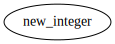

Show all the functions that call "new_integer"

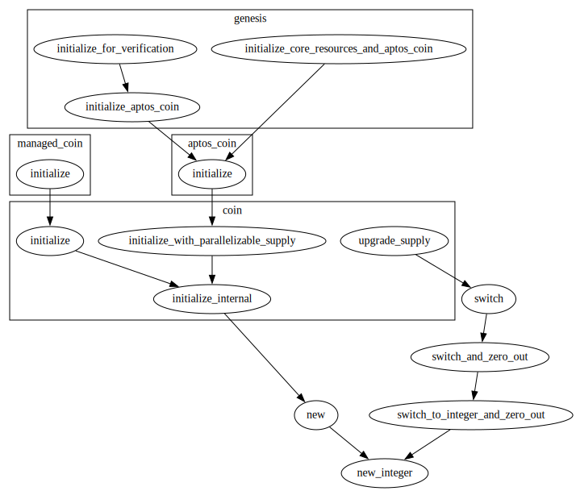

## Function `add_integer`

<pre><code><b>fun</b> <a href="optional_aggregator.md#0x1_optional_aggregator_add_integer">add_integer</a>(integer: &<b>mut</b> <a href="optional_aggregator.md#0x1_optional_aggregator_Integer">optional_aggregator::Integer</a>, value: u128)
</code></pre>

Implementation

<pre><code><b>fun</b> <a href="optional_aggregator.md#0x1_optional_aggregator_add_integer">add_integer</a>(integer: &<b>mut</b> <a href="optional_aggregator.md#0x1_optional_aggregator_Integer">Integer</a>, value: u128) {
    <b>assert</b>!(
        value &lt;= (integer.limit - integer.value),
        <a href="../../aptos-stdlib/../move-stdlib/doc/error.md#0x1_error_out_of_range">error::out_of_range</a>(<a href="optional_aggregator.md#0x1_optional_aggregator_EAGGREGATOR_OVERFLOW">EAGGREGATOR_OVERFLOW</a>)
    );
    integer.value = integer.value + value;
}
</code></pre>

Show all the functions that "add_integer" calls

Show all the functions that call "add_integer"

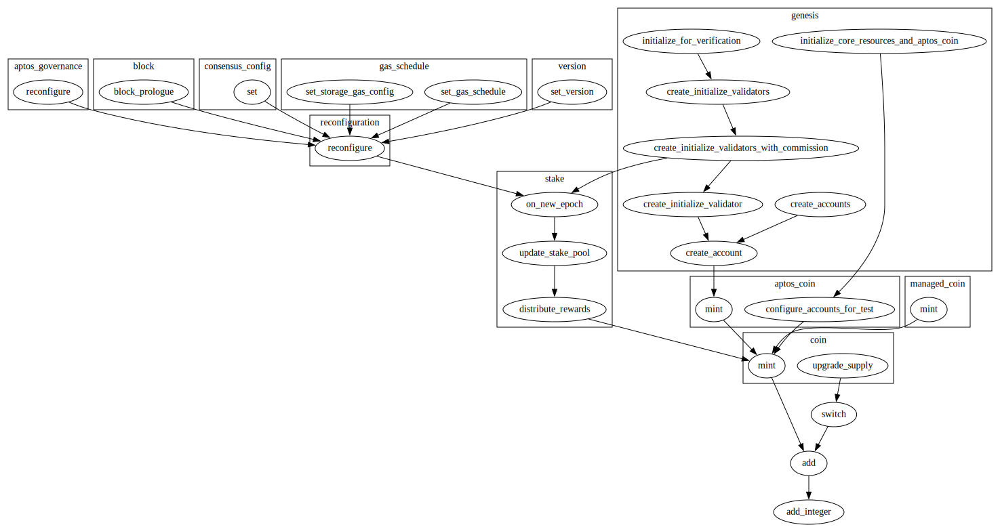

## Function `sub_integer`

<pre><code><b>fun</b> <a href="optional_aggregator.md#0x1_optional_aggregator_sub_integer">sub_integer</a>(integer: &<b>mut</b> <a href="optional_aggregator.md#0x1_optional_aggregator_Integer">optional_aggregator::Integer</a>, value: u128)
</code></pre>

Implementation

<pre><code><b>fun</b> <a href="optional_aggregator.md#0x1_optional_aggregator_sub_integer">sub_integer</a>(integer: &<b>mut</b> <a href="optional_aggregator.md#0x1_optional_aggregator_Integer">Integer</a>, value: u128) {
    <b>assert</b>!(value &lt;= integer.value, <a href="../../aptos-stdlib/../move-stdlib/doc/error.md#0x1_error_out_of_range">error::out_of_range</a>(<a href="optional_aggregator.md#0x1_optional_aggregator_EAGGREGATOR_UNDERFLOW">EAGGREGATOR_UNDERFLOW</a>));
    integer.value = integer.value - value;
}
</code></pre>

Show all the functions that "sub_integer" calls

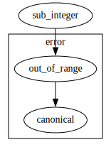

Show all the functions that call "sub_integer"

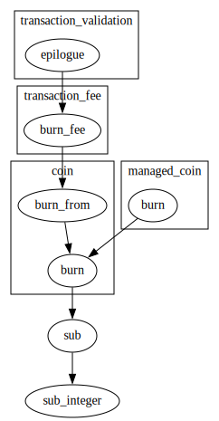

## Function `limit`

<pre><code><b>fun</b> <a href="optional_aggregator.md#0x1_optional_aggregator_limit">limit</a>(integer: &<a href="optional_aggregator.md#0x1_optional_aggregator_Integer">optional_aggregator::Integer</a>): u128
</code></pre>

Implementation

<pre><code><b>fun</b> <a href="optional_aggregator.md#0x1_optional_aggregator_limit">limit</a>(integer: &<a href="optional_aggregator.md#0x1_optional_aggregator_Integer">Integer</a>): u128 {
    integer.limit
}
</code></pre>

Show all the functions that "limit" calls

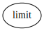

Show all the functions that call "limit"

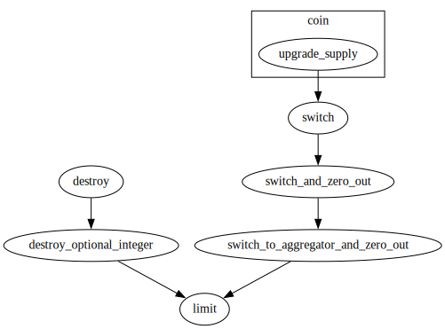

## Function `read_integer`

<pre><code><b>fun</b> <a href="optional_aggregator.md#0x1_optional_aggregator_read_integer">read_integer</a>(integer: &<a href="optional_aggregator.md#0x1_optional_aggregator_Integer">optional_aggregator::Integer</a>): u128
</code></pre>

Implementation

<pre><code><b>fun</b> <a href="optional_aggregator.md#0x1_optional_aggregator_read_integer">read_integer</a>(integer: &<a href="optional_aggregator.md#0x1_optional_aggregator_Integer">Integer</a>): u128 {
    integer.value
}
</code></pre>

Show all the functions that "read_integer" calls

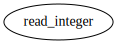

Show all the functions that call "read_integer"

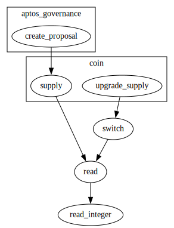

## Function `destroy_integer`

<pre><code><b>fun</b> <a href="optional_aggregator.md#0x1_optional_aggregator_destroy_integer">destroy_integer</a>(integer: <a href="optional_aggregator.md#0x1_optional_aggregator_Integer">optional_aggregator::Integer</a>)
</code></pre>

Implementation

<pre><code><b>fun</b> <a href="optional_aggregator.md#0x1_optional_aggregator_destroy_integer">destroy_integer</a>(integer: <a href="optional_aggregator.md#0x1_optional_aggregator_Integer">Integer</a>) {
    <b>let</b> <a href="optional_aggregator.md#0x1_optional_aggregator_Integer">Integer</a> { value: _, limit: _ } = integer;
}
</code></pre>

Show all the functions that "destroy_integer" calls

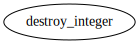

Show all the functions that call "destroy_integer"

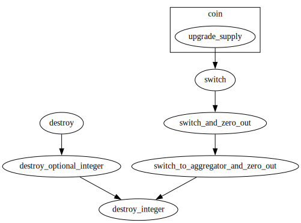

## Function `new`

Creates a new optional aggregator instance.

<pre><code><b>public</b>(<b>friend</b>) <b>fun</b> <a href="optional_aggregator.md#0x1_optional_aggregator_new">new</a>(limit: u128, parallelizable: bool): <a href="optional_aggregator.md#0x1_optional_aggregator_OptionalAggregator">optional_aggregator::OptionalAggregator</a>
</code></pre>

Implementation

<pre><code><b>public</b>(<b>friend</b>) <b>fun</b> <a href="optional_aggregator.md#0x1_optional_aggregator_new">new</a>(limit: u128, parallelizable: bool): <a href="optional_aggregator.md#0x1_optional_aggregator_OptionalAggregator">OptionalAggregator</a> {
    <b>if</b> (parallelizable) {
        <a href="optional_aggregator.md#0x1_optional_aggregator_OptionalAggregator">OptionalAggregator</a> {
            <a href="aggregator.md#0x1_aggregator">aggregator</a>: <a href="../../aptos-stdlib/../move-stdlib/doc/option.md#0x1_option_some">option::some</a>(<a href="aggregator_factory.md#0x1_aggregator_factory_create_aggregator_internal">aggregator_factory::create_aggregator_internal</a>(limit)),
            integer: <a href="../../aptos-stdlib/../move-stdlib/doc/option.md#0x1_option_none">option::none</a>(),
        }
    } <b>else</b> {
        <a href="optional_aggregator.md#0x1_optional_aggregator_OptionalAggregator">OptionalAggregator</a> {
            <a href="aggregator.md#0x1_aggregator">aggregator</a>: <a href="../../aptos-stdlib/../move-stdlib/doc/option.md#0x1_option_none">option::none</a>(),
            integer: <a href="../../aptos-stdlib/../move-stdlib/doc/option.md#0x1_option_some">option::some</a>(<a href="optional_aggregator.md#0x1_optional_aggregator_new_integer">new_integer</a>(limit)),
        }
    }
}
</code></pre>

Show all the functions that "new" calls

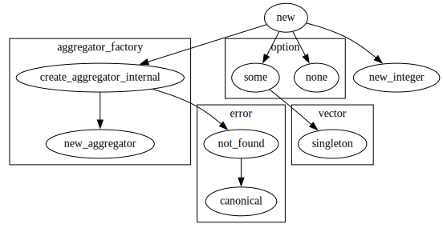

Show all the functions that call "new"

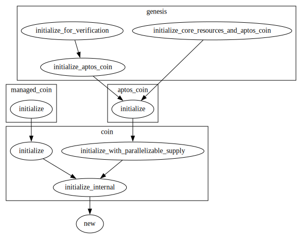

## Function `switch`

Switches between parallelizable and non-parallelizable implementations.

<pre><code><b>public</b> <b>fun</b> <a href="optional_aggregator.md#0x1_optional_aggregator_switch">switch</a>(<a href="optional_aggregator.md#0x1_optional_aggregator">optional_aggregator</a>: &<b>mut</b> <a href="optional_aggregator.md#0x1_optional_aggregator_OptionalAggregator">optional_aggregator::OptionalAggregator</a>)
</code></pre>

Implementation

<pre><code><b>public</b> <b>fun</b> <a href="optional_aggregator.md#0x1_optional_aggregator_switch">switch</a>(<a href="optional_aggregator.md#0x1_optional_aggregator">optional_aggregator</a>: &<b>mut</b> <a href="optional_aggregator.md#0x1_optional_aggregator_OptionalAggregator">OptionalAggregator</a>) {
    <b>let</b> value = <a href="optional_aggregator.md#0x1_optional_aggregator_read">read</a>(<a href="optional_aggregator.md#0x1_optional_aggregator">optional_aggregator</a>);
    <a href="optional_aggregator.md#0x1_optional_aggregator_switch_and_zero_out">switch_and_zero_out</a>(<a href="optional_aggregator.md#0x1_optional_aggregator">optional_aggregator</a>);
    <a href="optional_aggregator.md#0x1_optional_aggregator_add">add</a>(<a href="optional_aggregator.md#0x1_optional_aggregator">optional_aggregator</a>, value);
}
</code></pre>

Show all the functions that "switch" calls

Show all the functions that call "switch"

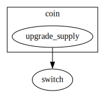

## Function `switch_and_zero_out`

Switches between parallelizable and non-parallelizable implementations, setting
the value of the new optional aggregator to zero.

<pre><code><b>fun</b> <a href="optional_aggregator.md#0x1_optional_aggregator_switch_and_zero_out">switch_and_zero_out</a>(<a href="optional_aggregator.md#0x1_optional_aggregator">optional_aggregator</a>: &<b>mut</b> <a href="optional_aggregator.md#0x1_optional_aggregator_OptionalAggregator">optional_aggregator::OptionalAggregator</a>)
</code></pre>

Implementation

<pre><code><b>fun</b> <a href="optional_aggregator.md#0x1_optional_aggregator_switch_and_zero_out">switch_and_zero_out</a>(<a href="optional_aggregator.md#0x1_optional_aggregator">optional_aggregator</a>: &<b>mut</b> <a href="optional_aggregator.md#0x1_optional_aggregator_OptionalAggregator">OptionalAggregator</a>) {
    <b>if</b> (<a href="optional_aggregator.md#0x1_optional_aggregator_is_parallelizable">is_parallelizable</a>(<a href="optional_aggregator.md#0x1_optional_aggregator">optional_aggregator</a>)) {
        <a href="optional_aggregator.md#0x1_optional_aggregator_switch_to_integer_and_zero_out">switch_to_integer_and_zero_out</a>(<a href="optional_aggregator.md#0x1_optional_aggregator">optional_aggregator</a>);
    } <b>else</b> {
        <a href="optional_aggregator.md#0x1_optional_aggregator_switch_to_aggregator_and_zero_out">switch_to_aggregator_and_zero_out</a>(<a href="optional_aggregator.md#0x1_optional_aggregator">optional_aggregator</a>);
    }
}
</code></pre>

Show all the functions that "switch_and_zero_out" calls

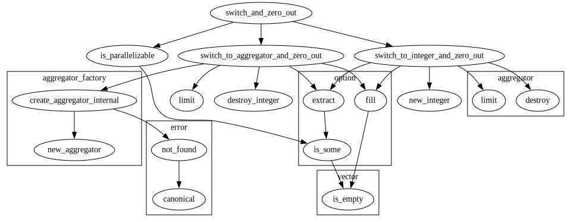

Show all the functions that call "switch_and_zero_out"

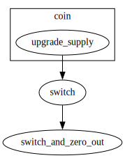

## Function `switch_to_integer_and_zero_out`

Switches from parallelizable to non-parallelizable implementation, zero-initializing
the value.

<pre><code><b>fun</b> <a href="optional_aggregator.md#0x1_optional_aggregator_switch_to_integer_and_zero_out">switch_to_integer_and_zero_out</a>(<a href="optional_aggregator.md#0x1_optional_aggregator">optional_aggregator</a>: &<b>mut</b> <a href="optional_aggregator.md#0x1_optional_aggregator_OptionalAggregator">optional_aggregator::OptionalAggregator</a>): u128
</code></pre>

Implementation

<pre><code><b>fun</b> <a href="optional_aggregator.md#0x1_optional_aggregator_switch_to_integer_and_zero_out">switch_to_integer_and_zero_out</a>(
    <a href="optional_aggregator.md#0x1_optional_aggregator">optional_aggregator</a>: &<b>mut</b> <a href="optional_aggregator.md#0x1_optional_aggregator_OptionalAggregator">OptionalAggregator</a>
): u128 {
    <b>let</b> <a href="aggregator.md#0x1_aggregator">aggregator</a> = <a href="../../aptos-stdlib/../move-stdlib/doc/option.md#0x1_option_extract">option::extract</a>(&<b>mut</b> <a href="optional_aggregator.md#0x1_optional_aggregator">optional_aggregator</a>.<a href="aggregator.md#0x1_aggregator">aggregator</a>);
    <b>let</b> limit = <a href="aggregator.md#0x1_aggregator_limit">aggregator::limit</a>(&<a href="aggregator.md#0x1_aggregator">aggregator</a>);
    <a href="aggregator.md#0x1_aggregator_destroy">aggregator::destroy</a>(<a href="aggregator.md#0x1_aggregator">aggregator</a>);
    <b>let</b> integer = <a href="optional_aggregator.md#0x1_optional_aggregator_new_integer">new_integer</a>(limit);
    <a href="../../aptos-stdlib/../move-stdlib/doc/option.md#0x1_option_fill">option::fill</a>(&<b>mut</b> <a href="optional_aggregator.md#0x1_optional_aggregator">optional_aggregator</a>.integer, integer);
    limit
}
</code></pre>

Show all the functions that "switch_to_integer_and_zero_out" calls

Show all the functions that call "switch_to_integer_and_zero_out"

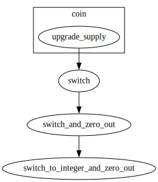

## Function `switch_to_aggregator_and_zero_out`

Switches from non-parallelizable to parallelizable implementation, zero-initializing
the value.

<pre><code><b>fun</b> <a href="optional_aggregator.md#0x1_optional_aggregator_switch_to_aggregator_and_zero_out">switch_to_aggregator_and_zero_out</a>(<a href="optional_aggregator.md#0x1_optional_aggregator">optional_aggregator</a>: &<b>mut</b> <a href="optional_aggregator.md#0x1_optional_aggregator_OptionalAggregator">optional_aggregator::OptionalAggregator</a>): u128
</code></pre>

Implementation

<pre><code><b>fun</b> <a href="optional_aggregator.md#0x1_optional_aggregator_switch_to_aggregator_and_zero_out">switch_to_aggregator_and_zero_out</a>(
    <a href="optional_aggregator.md#0x1_optional_aggregator">optional_aggregator</a>: &<b>mut</b> <a href="optional_aggregator.md#0x1_optional_aggregator_OptionalAggregator">OptionalAggregator</a>
): u128 {
    <b>let</b> integer = <a href="../../aptos-stdlib/../move-stdlib/doc/option.md#0x1_option_extract">option::extract</a>(&<b>mut</b> <a href="optional_aggregator.md#0x1_optional_aggregator">optional_aggregator</a>.integer);
    <b>let</b> limit = <a href="optional_aggregator.md#0x1_optional_aggregator_limit">limit</a>(&integer);
    <a href="optional_aggregator.md#0x1_optional_aggregator_destroy_integer">destroy_integer</a>(integer);
    <b>let</b> <a href="aggregator.md#0x1_aggregator">aggregator</a> = <a href="aggregator_factory.md#0x1_aggregator_factory_create_aggregator_internal">aggregator_factory::create_aggregator_internal</a>(limit);
    <a href="../../aptos-stdlib/../move-stdlib/doc/option.md#0x1_option_fill">option::fill</a>(&<b>mut</b> <a href="optional_aggregator.md#0x1_optional_aggregator">optional_aggregator</a>.<a href="aggregator.md#0x1_aggregator">aggregator</a>, <a href="aggregator.md#0x1_aggregator">aggregator</a>);
    limit
}
</code></pre>

Show all the functions that "switch_to_aggregator_and_zero_out" calls

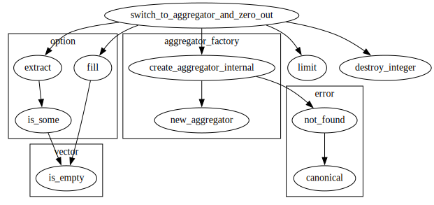

Show all the functions that call "switch_to_aggregator_and_zero_out"

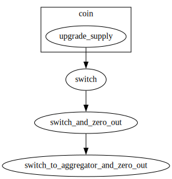

## Function `destroy`

Destroys optional aggregator.

<pre><code><b>public</b> <b>fun</b> <a href="optional_aggregator.md#0x1_optional_aggregator_destroy">destroy</a>(<a href="optional_aggregator.md#0x1_optional_aggregator">optional_aggregator</a>: <a href="optional_aggregator.md#0x1_optional_aggregator_OptionalAggregator">optional_aggregator::OptionalAggregator</a>)
</code></pre>

Implementation

<pre><code><b>public</b> <b>fun</b> <a href="optional_aggregator.md#0x1_optional_aggregator_destroy">destroy</a>(<a href="optional_aggregator.md#0x1_optional_aggregator">optional_aggregator</a>: <a href="optional_aggregator.md#0x1_optional_aggregator_OptionalAggregator">OptionalAggregator</a>) {
    <b>if</b> (<a href="optional_aggregator.md#0x1_optional_aggregator_is_parallelizable">is_parallelizable</a>(&<a href="optional_aggregator.md#0x1_optional_aggregator">optional_aggregator</a>)) {
        <a href="optional_aggregator.md#0x1_optional_aggregator_destroy_optional_aggregator">destroy_optional_aggregator</a>(<a href="optional_aggregator.md#0x1_optional_aggregator">optional_aggregator</a>);
    } <b>else</b> {
        <a href="optional_aggregator.md#0x1_optional_aggregator_destroy_optional_integer">destroy_optional_integer</a>(<a href="optional_aggregator.md#0x1_optional_aggregator">optional_aggregator</a>);
    }
}
</code></pre>

Show all the functions that "destroy" calls

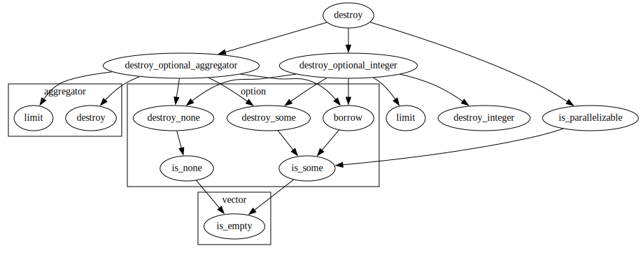

Show all the functions that call "destroy"

## Function `destroy_optional_aggregator`

Destroys parallelizable optional aggregator and returns its limit.

<pre><code><b>fun</b> <a href="optional_aggregator.md#0x1_optional_aggregator_destroy_optional_aggregator">destroy_optional_aggregator</a>(<a href="optional_aggregator.md#0x1_optional_aggregator">optional_aggregator</a>: <a href="optional_aggregator.md#0x1_optional_aggregator_OptionalAggregator">optional_aggregator::OptionalAggregator</a>): u128
</code></pre>

Implementation

<pre><code><b>fun</b> <a href="optional_aggregator.md#0x1_optional_aggregator_destroy_optional_aggregator">destroy_optional_aggregator</a>(<a href="optional_aggregator.md#0x1_optional_aggregator">optional_aggregator</a>: <a href="optional_aggregator.md#0x1_optional_aggregator_OptionalAggregator">OptionalAggregator</a>): u128 {
    <b>let</b> <a href="optional_aggregator.md#0x1_optional_aggregator_OptionalAggregator">OptionalAggregator</a> { <a href="aggregator.md#0x1_aggregator">aggregator</a>, integer } = <a href="optional_aggregator.md#0x1_optional_aggregator">optional_aggregator</a>;
    <b>let</b> limit = <a href="aggregator.md#0x1_aggregator_limit">aggregator::limit</a>(<a href="../../aptos-stdlib/../move-stdlib/doc/option.md#0x1_option_borrow">option::borrow</a>(&<a href="aggregator.md#0x1_aggregator">aggregator</a>));
    <a href="aggregator.md#0x1_aggregator_destroy">aggregator::destroy</a>(<a href="../../aptos-stdlib/../move-stdlib/doc/option.md#0x1_option_destroy_some">option::destroy_some</a>(<a href="aggregator.md#0x1_aggregator">aggregator</a>));
    <a href="../../aptos-stdlib/../move-stdlib/doc/option.md#0x1_option_destroy_none">option::destroy_none</a>(integer);
    limit
}
</code></pre>

Show all the functions that "destroy_optional_aggregator" calls

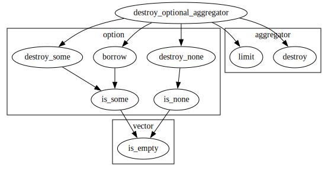

Show all the functions that call "destroy_optional_aggregator"

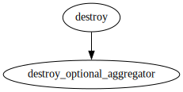

## Function `destroy_optional_integer`

Destroys non-parallelizable optional aggregator and returns its limit.

<pre><code><b>fun</b> <a href="optional_aggregator.md#0x1_optional_aggregator_destroy_optional_integer">destroy_optional_integer</a>(<a href="optional_aggregator.md#0x1_optional_aggregator">optional_aggregator</a>: <a href="optional_aggregator.md#0x1_optional_aggregator_OptionalAggregator">optional_aggregator::OptionalAggregator</a>): u128
</code></pre>

Implementation

<pre><code><b>fun</b> <a href="optional_aggregator.md#0x1_optional_aggregator_destroy_optional_integer">destroy_optional_integer</a>(<a href="optional_aggregator.md#0x1_optional_aggregator">optional_aggregator</a>: <a href="optional_aggregator.md#0x1_optional_aggregator_OptionalAggregator">OptionalAggregator</a>): u128 {
    <b>let</b> <a href="optional_aggregator.md#0x1_optional_aggregator_OptionalAggregator">OptionalAggregator</a> { <a href="aggregator.md#0x1_aggregator">aggregator</a>, integer } = <a href="optional_aggregator.md#0x1_optional_aggregator">optional_aggregator</a>;
    <b>let</b> limit = <a href="optional_aggregator.md#0x1_optional_aggregator_limit">limit</a>(<a href="../../aptos-stdlib/../move-stdlib/doc/option.md#0x1_option_borrow">option::borrow</a>(&integer));
    <a href="optional_aggregator.md#0x1_optional_aggregator_destroy_integer">destroy_integer</a>(<a href="../../aptos-stdlib/../move-stdlib/doc/option.md#0x1_option_destroy_some">option::destroy_some</a>(integer));
    <a href="../../aptos-stdlib/../move-stdlib/doc/option.md#0x1_option_destroy_none">option::destroy_none</a>(<a href="aggregator.md#0x1_aggregator">aggregator</a>);
    limit
}
</code></pre>

Show all the functions that "destroy_optional_integer" calls

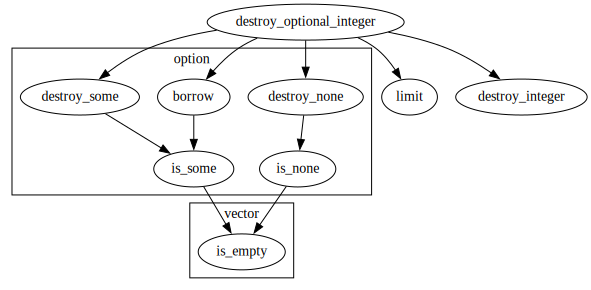

Show all the functions that call "destroy_optional_integer"

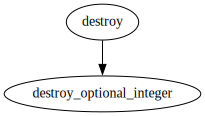

## Function `add`

Adds to optional aggregator, aborting on exceeding the <code>limit</code>.

<pre><code><b>public</b> <b>fun</b> <a href="optional_aggregator.md#0x1_optional_aggregator_add">add</a>(<a href="optional_aggregator.md#0x1_optional_aggregator">optional_aggregator</a>: &<b>mut</b> <a href="optional_aggregator.md#0x1_optional_aggregator_OptionalAggregator">optional_aggregator::OptionalAggregator</a>, value: u128)
</code></pre>

Implementation

<pre><code><b>public</b> <b>fun</b> <a href="optional_aggregator.md#0x1_optional_aggregator_add">add</a>(<a href="optional_aggregator.md#0x1_optional_aggregator">optional_aggregator</a>: &<b>mut</b> <a href="optional_aggregator.md#0x1_optional_aggregator_OptionalAggregator">OptionalAggregator</a>, value: u128) {
    <b>if</b> (<a href="../../aptos-stdlib/../move-stdlib/doc/option.md#0x1_option_is_some">option::is_some</a>(&<a href="optional_aggregator.md#0x1_optional_aggregator">optional_aggregator</a>.<a href="aggregator.md#0x1_aggregator">aggregator</a>)) {
        <b>let</b> <a href="aggregator.md#0x1_aggregator">aggregator</a> = <a href="../../aptos-stdlib/../move-stdlib/doc/option.md#0x1_option_borrow_mut">option::borrow_mut</a>(&<b>mut</b> <a href="optional_aggregator.md#0x1_optional_aggregator">optional_aggregator</a>.<a href="aggregator.md#0x1_aggregator">aggregator</a>);
        <a href="aggregator.md#0x1_aggregator_add">aggregator::add</a>(<a href="aggregator.md#0x1_aggregator">aggregator</a>, value);
    } <b>else</b> {
        <b>let</b> integer = <a href="../../aptos-stdlib/../move-stdlib/doc/option.md#0x1_option_borrow_mut">option::borrow_mut</a>(&<b>mut</b> <a href="optional_aggregator.md#0x1_optional_aggregator">optional_aggregator</a>.integer);
        <a href="optional_aggregator.md#0x1_optional_aggregator_add_integer">add_integer</a>(integer, value);
    }
}
</code></pre>

Show all the functions that "add" calls

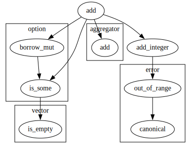

Show all the functions that call "add"

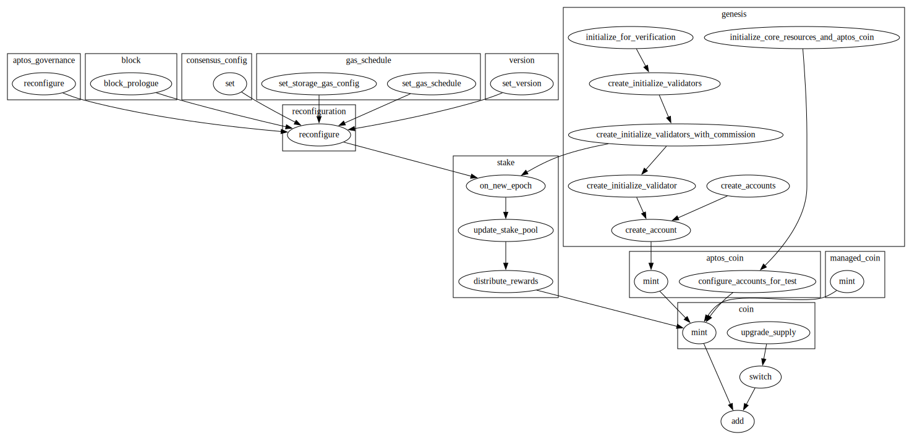

## Function `sub`

Subtracts from optional aggregator, aborting on going below zero.

<pre><code><b>public</b> <b>fun</b> <a href="optional_aggregator.md#0x1_optional_aggregator_sub">sub</a>(<a href="optional_aggregator.md#0x1_optional_aggregator">optional_aggregator</a>: &<b>mut</b> <a href="optional_aggregator.md#0x1_optional_aggregator_OptionalAggregator">optional_aggregator::OptionalAggregator</a>, value: u128)
</code></pre>

Implementation

<pre><code><b>public</b> <b>fun</b> <a href="optional_aggregator.md#0x1_optional_aggregator_sub">sub</a>(<a href="optional_aggregator.md#0x1_optional_aggregator">optional_aggregator</a>: &<b>mut</b> <a href="optional_aggregator.md#0x1_optional_aggregator_OptionalAggregator">OptionalAggregator</a>, value: u128) {
    <b>if</b> (<a href="../../aptos-stdlib/../move-stdlib/doc/option.md#0x1_option_is_some">option::is_some</a>(&<a href="optional_aggregator.md#0x1_optional_aggregator">optional_aggregator</a>.<a href="aggregator.md#0x1_aggregator">aggregator</a>)) {
        <b>let</b> <a href="aggregator.md#0x1_aggregator">aggregator</a> = <a href="../../aptos-stdlib/../move-stdlib/doc/option.md#0x1_option_borrow_mut">option::borrow_mut</a>(&<b>mut</b> <a href="optional_aggregator.md#0x1_optional_aggregator">optional_aggregator</a>.<a href="aggregator.md#0x1_aggregator">aggregator</a>);
        <a href="aggregator.md#0x1_aggregator_sub">aggregator::sub</a>(<a href="aggregator.md#0x1_aggregator">aggregator</a>, value);
    } <b>else</b> {
        <b>let</b> integer = <a href="../../aptos-stdlib/../move-stdlib/doc/option.md#0x1_option_borrow_mut">option::borrow_mut</a>(&<b>mut</b> <a href="optional_aggregator.md#0x1_optional_aggregator">optional_aggregator</a>.integer);
        <a href="optional_aggregator.md#0x1_optional_aggregator_sub_integer">sub_integer</a>(integer, value);
    }
}
</code></pre>

Show all the functions that "sub" calls

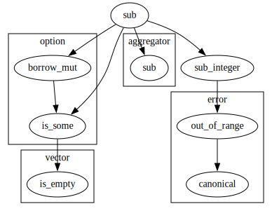

Show all the functions that call "sub"

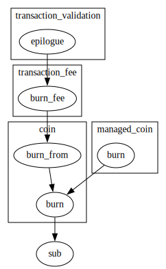

## Function `read`

Returns the value stored in optional aggregator.

<pre><code><b>public</b> <b>fun</b> <a href="optional_aggregator.md#0x1_optional_aggregator_read">read</a>(<a href="optional_aggregator.md#0x1_optional_aggregator">optional_aggregator</a>: &<a href="optional_aggregator.md#0x1_optional_aggregator_OptionalAggregator">optional_aggregator::OptionalAggregator</a>): u128
</code></pre>

Implementation

<pre><code><b>public</b> <b>fun</b> <a href="optional_aggregator.md#0x1_optional_aggregator_read">read</a>(<a href="optional_aggregator.md#0x1_optional_aggregator">optional_aggregator</a>: &<a href="optional_aggregator.md#0x1_optional_aggregator_OptionalAggregator">OptionalAggregator</a>): u128 {
    <b>if</b> (<a href="../../aptos-stdlib/../move-stdlib/doc/option.md#0x1_option_is_some">option::is_some</a>(&<a href="optional_aggregator.md#0x1_optional_aggregator">optional_aggregator</a>.<a href="aggregator.md#0x1_aggregator">aggregator</a>)) {
        <b>let</b> <a href="aggregator.md#0x1_aggregator">aggregator</a> = <a href="../../aptos-stdlib/../move-stdlib/doc/option.md#0x1_option_borrow">option::borrow</a>(&<a href="optional_aggregator.md#0x1_optional_aggregator">optional_aggregator</a>.<a href="aggregator.md#0x1_aggregator">aggregator</a>);
        <a href="aggregator.md#0x1_aggregator_read">aggregator::read</a>(<a href="aggregator.md#0x1_aggregator">aggregator</a>)
    } <b>else</b> {
        <b>let</b> integer = <a href="../../aptos-stdlib/../move-stdlib/doc/option.md#0x1_option_borrow">option::borrow</a>(&<a href="optional_aggregator.md#0x1_optional_aggregator">optional_aggregator</a>.integer);
        <a href="optional_aggregator.md#0x1_optional_aggregator_read_integer">read_integer</a>(integer)
    }
}
</code></pre>

Show all the functions that "read" calls

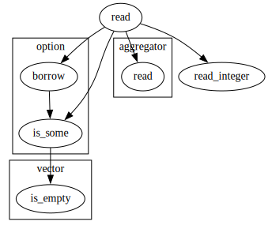

Show all the functions that call "read"

## Function `is_parallelizable`

Returns true is optional aggregator uses parallelizable implementation.

<pre><code><b>public</b> <b>fun</b> <a href="optional_aggregator.md#0x1_optional_aggregator_is_parallelizable">is_parallelizable</a>(<a href="optional_aggregator.md#0x1_optional_aggregator">optional_aggregator</a>: &<a href="optional_aggregator.md#0x1_optional_aggregator_OptionalAggregator">optional_aggregator::OptionalAggregator</a>): bool
</code></pre>

Implementation

<pre><code><b>public</b> <b>fun</b> <a href="optional_aggregator.md#0x1_optional_aggregator_is_parallelizable">is_parallelizable</a>(<a href="optional_aggregator.md#0x1_optional_aggregator">optional_aggregator</a>: &<a href="optional_aggregator.md#0x1_optional_aggregator_OptionalAggregator">OptionalAggregator</a>): bool {
    <a href="../../aptos-stdlib/../move-stdlib/doc/option.md#0x1_option_is_some">option::is_some</a>(&<a href="optional_aggregator.md#0x1_optional_aggregator">optional_aggregator</a>.<a href="aggregator.md#0x1_aggregator">aggregator</a>)
}
</code></pre>

Show all the functions that "is_parallelizable" calls

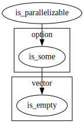

Show all the functions that call "is_parallelizable"

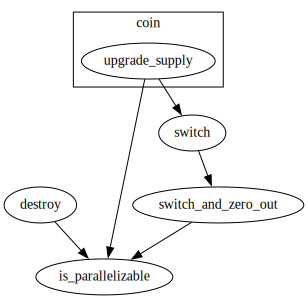

## Specification

<pre><code><b>pragma</b> verify = <b>false</b>;
</code></pre>

[move-book]: https://move-language.github.io/move/introduction.html
